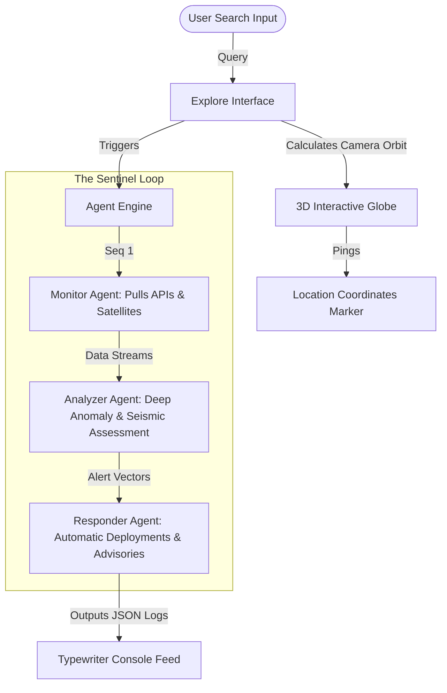

<div align="center">

<svg viewBox="0 0 100 100" width="120" height="120">
  <defs>
    <linearGradient id="logoGrad" x1="0%" y1="0%" x2="100%" y2="100%">
      <stop offset="0%" stop-color="#FF4D2E" />
      <stop offset="100%" stop-color="#7B8CFF" />
    </linearGradient>
  </defs>
  <circle cx="50" cy="50" r="45" fill="none" stroke="url(#logoGrad)" stroke-width="6" stroke-dasharray="10 5" />
  <path d="M25 50 Q40 20 50 50 T75 50" fill="none" stroke="#FF4D2E" stroke-width="5" stroke-linecap="round" />
  <circle cx="50" cy="50" r="4" fill="#3ECF8E" />
</svg>

# S A N G Y A N  ·  A I
### PRE-CRISIS INTELLIGENCE & MULTI-AGENT SENTINEL LOOP

[](https://react.dev/)
[](https://threejs.org/)
[](https://www.framer.com/motion/)
[](#)
[](#)

*A premium, hyper-realistic, dark-themed diagnostic application designed to analyze climate, geographical, and meteorological distress signals before they escalate.*

---
</div>

## 🌌 Overview
**SangyanAI** is a premium diagnostic terminal for geological and climatological crisis tracking. Embodying a minimalist aesthetic of deep charcoal and high-contrast alert indicators, it utilizes a simulated **three-stage AI Agent loop** (Monitor &rsaquo; Analyzer &rsaquo; Responder) to ingest weather patterns, seismic activities, and atmospheric shifts, presenting real-time actionable steps in under 400 milliseconds.

---

## ⚡ Key Highlights & Core Aesthetics
- **Left-Aligned Cinema Composition**: Shifted core display and callouts out of generic center structures into a sleek, column-aligned narrative view adorned with micro-animations.
- **Cinematic 3D Globe**: Custom React Three Fiber (R3F) wireframe globe utilizing custom shaders, real-time rotation, and interactive pulse points indicating search zones.
- **The Sentinel Loop**: A sequential typewriter execution console showing active logging feeds corresponding to three designated autonomous entities:
  - **Monitor**: Connects to live seismic networks (USGS), weather maps (Open-Meteo), and satellite matrices (NASA FIRMS).
  - **Analyzer**: Computes risk indices, evaluates anomalies, and details alarms.
  - **Responder**: Sets mitigation strategies, flags warnings, and distributes emergency guidelines.
- **Premium Typographic Scale**: Structured with **Outfit** for prominent headers to evoke modern technical precision, **Inter** for clean readability, and **JetBrains Mono** for low-latency coding logs.

---

## 🛠️ Architectural Breakdown



---

## 📦 Installed Dependencies & Core Technologies
- `react` & `react-dom` (v18.3.1)
- `three` & `@react-three/fiber` & `@react-three/drei` (3D rendering wrapper)
- `lucide-react` (Crisp vectors)
- `framer-motion` (Hardware-accelerated transitions)
- `gsap` (Dynamic scrolling events)
- `lenis` (Smooth inertial scroll driver)

---

## 🚀 Execution & Setup

### 1. Requirements
Ensure you have **Node.js v18.0.0+** installed.

### 2. Live Deployment
```bash
# Clone the repository
git clone https://github.com/adityagrinds/SangyanAI-2.git

# Move into source folder
cd SangyanAI-2

# Populate package dependencies
npm install

# Run the lightning-fast dev local pipeline
npm run dev
```

The application will run locally on `http://localhost:5173`.

---

## 🎨 Token & Color System
To maintain the **$1,000,000 Premium Studio** vibe, we utilize custom CSS custom variables:

| Variable | HEX / Fallback | CSS System Utility |
| :--- | :--- | :--- |
| `--color-bg-base` | `#07080a` | Deep canvas obsidian |
| `--color-accent-hero` | `#FF4D2E` | Crimson alarm and main accent |
| `--color-accent-success` | `#3ECF8E` | Stable condition indicators |
| `--color-accent-analyzer` | `#7B8CFF` | Neural assessment glow |
| `--font-display` | `Outfit` | High-impact technical headers |
| `--font-mono` | `JetBrains Mono` | Code terminals & pipeline outputs |

---

<div align="center">
Designed for global crisis monitoring. Engineered for precision and ultra-low latency response.
</div>
